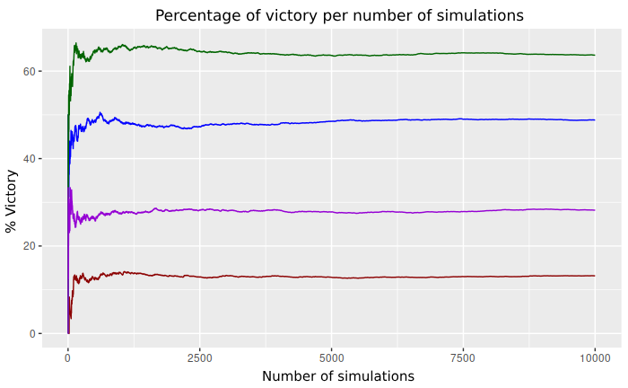

# Poker-MonteCarlo-C
A Monte Carlo-based probabilistic algorithm for calculating the probabilities of Texas Hold'em games. The code is written in C, and the implementation is fully standalone, relying only on the C Standard Library. In this project, probabilities are offered from two perspectives: the player's, who only knows their private cards (Hole Cards) and the community cards (Board Cards); and the spectator's, who knows every card in the game, both private and community, as well as discarded cards.

The algorithm provides, from the player's viewpoint, probabilities of victory, defeat, and tie, along with probabilities for obtaining each hand rank for both the player and their opponents. From the spectator's perspective, it provides probabilities of victory, defeat, tie, and probabilities for obtaining each hand rank for every player in the game.

This repository consists of three main parts: the Hand Evaluator, based on the Cactus Kev design [1]; the simulation algorithm, based on Monte Carlo, which computes the probabilities; and two examples, one from the player's perspective and one from the spectator's perspective.

# How to use it

First you will need to initialize the simulator, this step builds all the tables and data structures needed for the hand evaluation process. To do so, just call `init_simulator`, providing the path to the csv file with the *class equivalence table*, see `data/eq_classes.csv` and [1] for further explanation.

Then, you can obtain the probabilities by using the `simulate` and `simulate_spectator` functions. The approach, arguments, and return values are thoroughly explained in the comment header section of the code, see file `/src/simulation.c`. To understand how to use these functions, refer to the self-explanatory examples provided.

# Output examples
(Following examples refer to different game settlements.)
### Player's perspective
```
 - Player - 

        Victory : 40.364000%
        Defeat  : 57.451000%
        Tie     : 2.185000%

        Straight Flush  : 0.000000% 
        Four of a Kind  : 0.099000% 
        Full House      : 2.540000% 
        Flush           : 0.000000% 
        Straight        : 1.472000% 
        Three of a Kind : 6.604000% 
        Two Pair        : 37.455000% 
        One Pair        : 51.830000% 
        High Card       : 0.000000% 


 - Opponents - 

        Straight Flush  : 0.003250% 
        Four of a Kind  : 0.055250% 
        Full House      : 1.214750% 
        Flush           : 0.716500% 
        Straight        : 3.872000% 
        Three of a Kind : 3.449500% 
        Two Pair        : 18.784750% 
        One Pair        : 47.764000% 
        High Card       : 24.140000% 
```

### Spectator's perspective

```
- Player 0: 

        Victory : 5.388000%
        Defeat  : 94.612000%
        Tie     : 0.000000%

        Straight Flush  : 0.000000% 
        Four of a Kind  : 0.000000% 
        Full House      : 0.000000% 
        Flush           : 0.000000% 
        Straight        : 0.000000% 
        Three of a Kind : 5.388000% 
        Two Pair        : 26.142000% 
        One Pair        : 68.470000% 
        High Card       : 0.000000% 


 - Player 1: 

        Victory : 91.942000%
        Defeat  : 8.058000%
        Tie     : 0.000000%

        Straight Flush  : 0.000000% 
        Four of a Kind  : 0.000000% 
        Full House      : 0.000000% 
        Flush           : 0.000000% 
        Straight        : 7.914000% 
        Three of a Kind : 5.307000% 
        Two Pair        : 28.553000% 
        One Pair        : 58.226000% 
        High Card       : 0.000000% 


 - Player 2: 

        Victory : 2.670000%
        Defeat  : 97.330000%
        Tie     : 0.000000%

        Straight Flush  : 0.000000% 
        Four of a Kind  : 0.000000% 
        Full House      : 0.000000% 
        Flush           : 0.000000% 
        Straight        : 0.000000% 
        Three of a Kind : 2.670000% 
        Two Pair        : 26.142000% 
        One Pair        : 71.188000% 
        High Card       : 0.000000% 

```


# Performance metrics and Analysis
## Law of Large Numbers
In the following diagram you can see how the *Law of Large Numbers* manifests within the outcomes of the algorithm.



## Memory usage in Hand evaluator. 
Here it is a breakdown of the use of memory in the hand evaluator.
| Table     | Type | Size | Memory occupied in bytes |
|----------|-----|--------|--------------------------|
| *Flushes* scores | `unsigned short`  | 7937   | 15874 |
| Unique rank hands scores | `unsigned short`  | 7937   | 15874 |
| Prime products | `int`  | 4888   | 19552 |
| *Flushes* scores | `unsigned short`  | 7937   | 15874 |
| Non-unique rank hands scores | `unsigned short`  | 4888   | 9776 |
|**TOTAL**|||61076|
To know what the concepts that appears in this table mean, see [1].

## Hand evaluator benchmark
In the following table you can see the time performance of the hand evaluator algorithm.
| Number of evaluated hands | µs |
|---------------------------|----|
|1 000| 87 |
|10 000 |700|
|100 000| 5937|
|500 000| 22023|
|1 000 000| 41178|
|10 000 000 |406798|
|50 000 000| 2046058|
|100 000 000 |4078959|


## Simulator benchmark
In this table you can see the time performance of the simulator algorithm.


|Number of simulated games| A (µs)| B (µs)| C (µs)|
|--------------------|------|------|------|
|1 |14 |18 |20|
|10 |57 |64 |106|
|100 |490| 507 |822|
|1 000 |4 690 |4 964 |8 135|
|10 000 |47 428 |49 285 |82 365|
|100 000 |482 581 |493 197 |839 447|
|1 000 000 |4 790 794 |4 930 766 |8 312 356|
- **A**: games with 2 players and no established community cards.
- **B**: games with 4 players and 5 established community cards.
- **C**: games with 4 players and no established community cards.

Remember the *Central Limit Theorem*, and keep in mind that achieving 2 digits of precision in this kind of problem is usually enoguh. Thus, executing 100 000 simulations in **0.5 seconds** should be adequate.

# Notes
- The correct use of the algorithm is left to the users. There hasn't been an implementation of a check to verify if the inputs provided by the user are correct and make sense. Hence, you can assign to two different players the same cards.

- The design of the hand evaluator is from Catus Kev, but in the absence of the code that builds the tables he uses, I had personally implemented the algorithms to create those tables.

- To see an animation of how the simulation works, please watch the video about the larger project of which this work was a part, [2] (minute 1:21). 

# References
[1]: C. Kev, "Cactus kev’s poker hand evaluator," 2006, [Online]. Available: https://suffe.cool/poker/evaluator.html

[2]: G. Bibiloni Femenias, "UIB TFG - Gestor Mòbil per al Càlcul de Probabilitats d'un Joc de Texas Hold'em", YouTube, Available: https://www.youtube.com/watch?v=Ckk-ben1bqo
